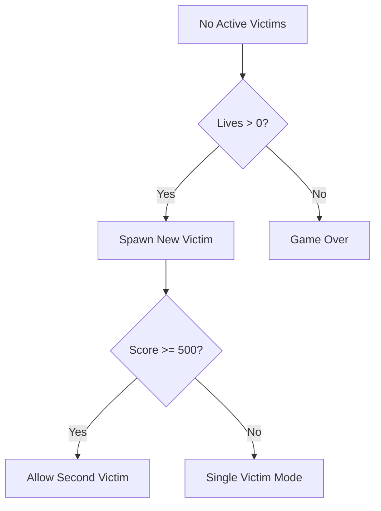
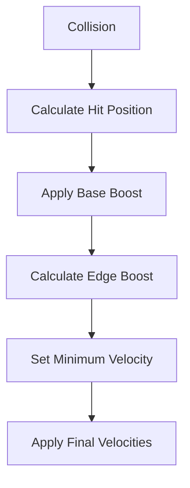
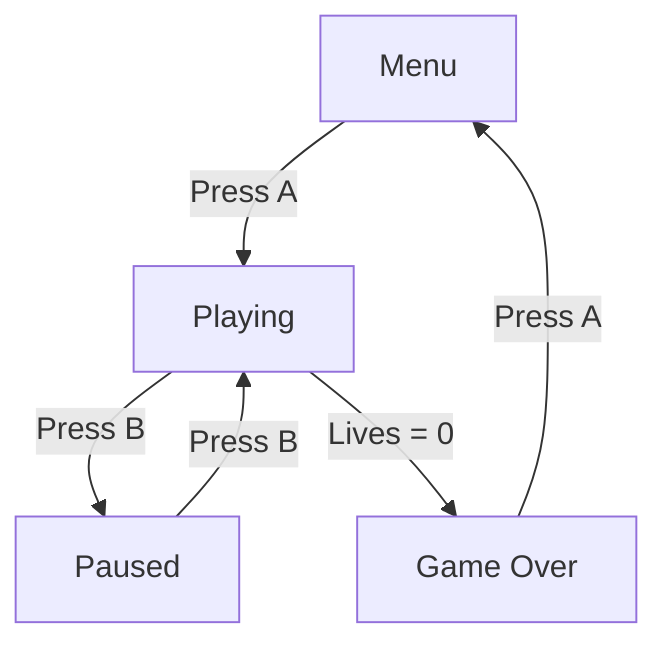

# System Patterns: Fire Game & Watch Remake

## Architecture Overview

### Component Structure
```
Game Core
├── Game Loop
│   ├── Input Processing (Crank)
│   ├── Physics Update
│   ├── Game State Update
│   └── Render
└── Entity System
    ├── Static Entities (Building, Ambulance)
    ├── Dynamic Entities (Victims, Firefighters)
    └── UI Elements (Score, Lives)
```

## Design Patterns

### Entity Component System
- Entities: Building, Victims, Firefighters, Ambulance
- Components: Position, Velocity, Sprite, Collision
- Systems: Physics, Rendering, State Management
- Entity Cleanup: Proper sprite removal between states

### State Management
- Game States: Menu, Playing, Paused, GameOver
- Entity States: Active, Rescued, Lost
- Clean State Transitions
- Sprite Management Between States

### Observer Pattern
- Event Types:
  - victimRescued: Score updates, high score checks
  - victimLost: Life reduction, game over check
  - catchAttempt: Physics response
  - gameOver: State transition
- Event Data: Position, velocity, hit position

### Physics System
- Gravity: 200 pixels/second squared
- Bounce Mechanics:
  - Edge-based bouncing (hit position -1 to 1)
  - Base horizontal boost (30 units)
  - Edge boost (up to 40 additional units)
  - Minimum bounce velocity (200 units)
- Initial Velocity: 100 pixels/second horizontal
- Collision Detection:
  - Rectangle-based for firefighters
  - Hit position calculation
  - Rescue zone checking

## Game Flow

### Spawn System


### Bounce Physics


### State Transitions


## Technical Implementation

### Physics Implementation
- Delta time-based updates
- Velocity damping (horizontal and vertical)
- Position clamping (screen boundaries)
- Hit position-based bounce angles

### Input Processing
- Crank sensitivity: 2.0
- Button state tracking
- State-based input handling
- Position clamping (80 to 350 x-axis)

### Rendering Pipeline
1. Clear screen (black background)
2. Draw entities (white sprites)
3. Update physics and positions
4. Draw UI (white text)
5. Handle state transitions

## Code Organization

### Directory Structure
```
source/
├── main.lua           # Game loop and state management
├── game/
│   ├── entities/      # Game objects
│   │   ├── building.lua
│   │   ├── firefighters.lua
│   │   ├── ambulance.lua
│   │   └── victim.lua
│   ├── physics/       # Physics calculations
│   ├── states/       # Game state handling
│   └── ui/           # User interface elements
└── assets/           # Game resources
```

### Memory Management
- Proper sprite cleanup
- State-based resource management
- Efficient entity pooling
- Clean transitions

## Performance Considerations
- Sprite batching
- Efficient collision detection
- Minimal object creation
- Clean state transitions
- Proper memory management

## Future Enhancements
- Sound effects system
- Particle effects
- Visual feedback
- Menu transitions
- Additional gameplay features
